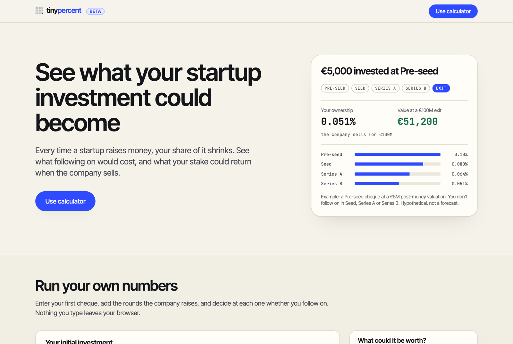
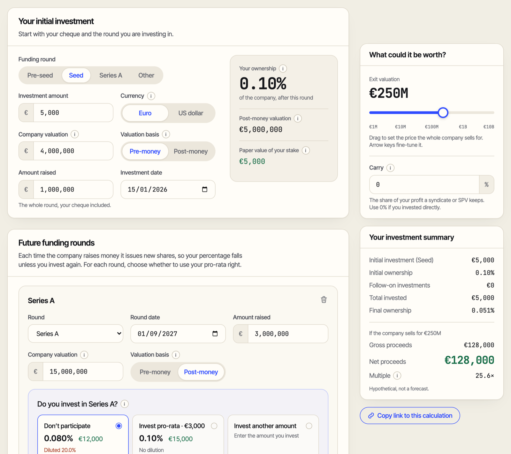
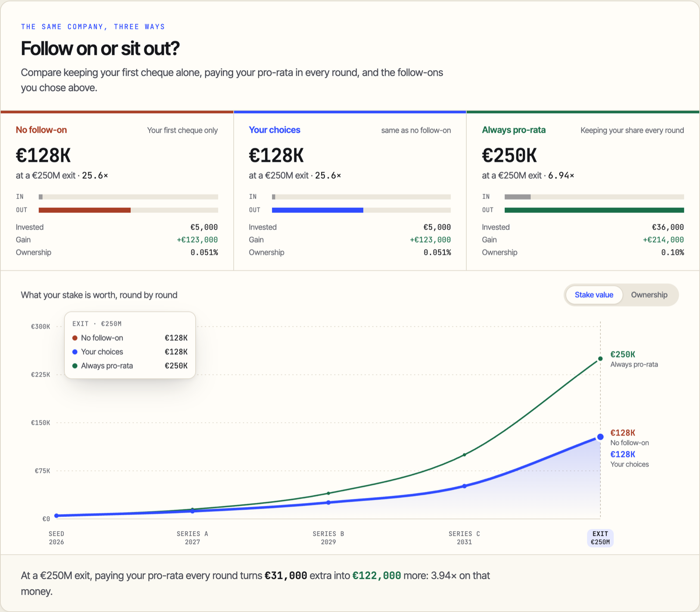
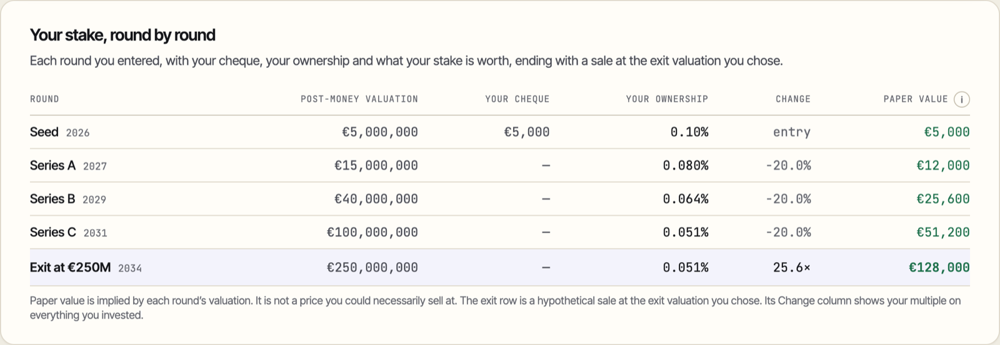
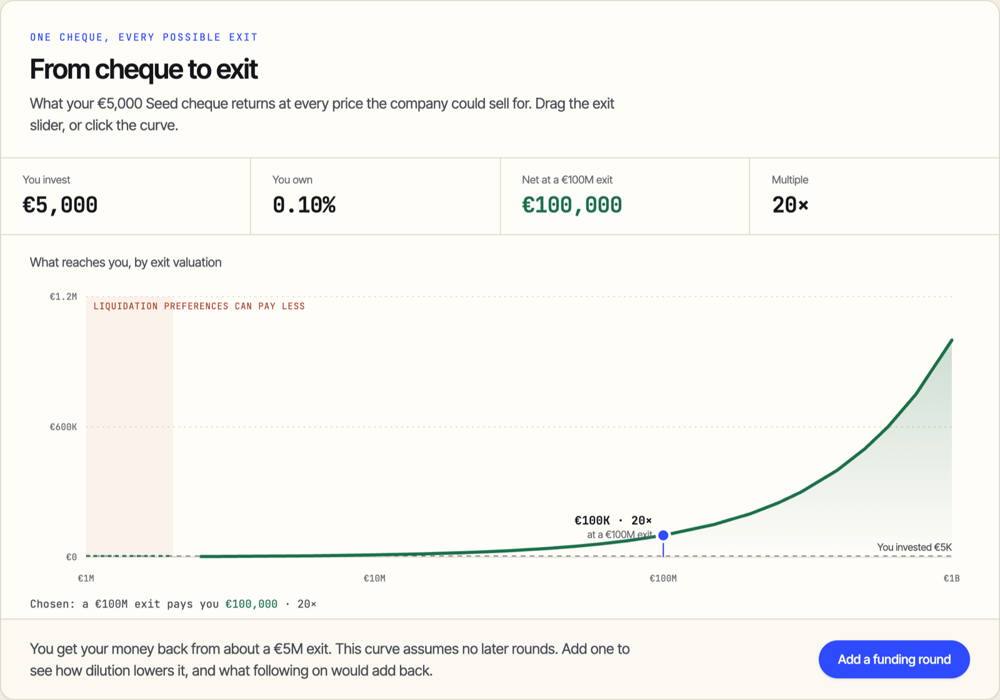
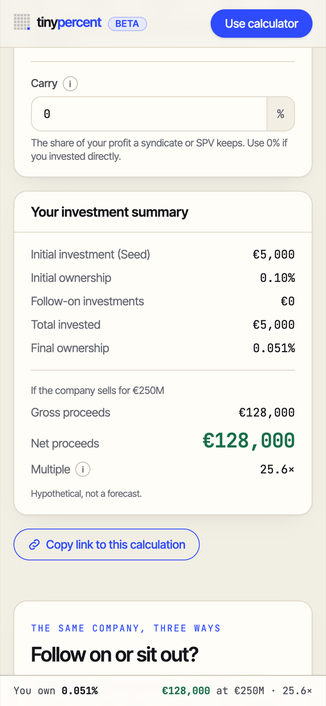

<div align="center">

# tinypercent

**Your tiny percent, from first cheque to exit.**

A free angel investment calculator that shows what your startup stake becomes as the company raises money, what following on would cost, and what it could return when the company sells.

[**Try it at tinypercent.com →**](https://tinypercent.com)

</div>



## Why it exists

Angel investors write small cheques into companies that go on to raise round after round. Every round issues new shares, so the percentage you bought shrinks, and the question every angel eventually faces is: *should I put more money in to keep my share?*

Spreadsheets answer that badly, and full cap-table tools ask for numbers an angel never sees. tinypercent works entirely from the angel's chair, using only what an angel actually knows: the cheque, each round's valuation and size, and a guess at the exit.

## What it does

### Follow your stake through every round

Enter your cheque and the rounds that follow. At each round, choose to sit out, pay your pro-rata to hold your share, or invest a different amount. Every choice updates your ownership, the paper value of your stake, and the return at exit, as you type.



### Follow on or sit out?

The same company, three ways: keeping your first cheque alone, paying your pro-rata in every round, and the choices you actually made, drawn side by side so the trade-off is visible at a glance.



### Every round in one table



### One cheque, every possible exit

Before any later rounds are added, a return curve shows what your cheque pays at every exit price, and flags the low exits where liquidation preferences could leave you with less.



### Also

- **Real round mechanics.** Pre-money or post-money valuations, new option pools created in a round, and pro-rata worked out for you.
- **Syndicate costs.** Carry, management fees and entry fees are taken out, so the multiple you see is what actually reaches you.
- **Shareable calculations.** "Copy link" produces a short link such as `tinypercent.com/shared#…` that reopens exactly what you were looking at. The calculation lives after the `#`, so it never reaches a server.
- **Private by design.** No account, no tracking, no backend for the calculator. Nothing you type leaves your browser.
- **Works on a phone**, with a summary bar that stays in view as you scroll.

<p align="center"></p>

## Examples

Each example opens in the live calculator with every input filled in.

**1. A small cheque that stays small in percentage terms.**
€5,000 at Seed (€4M pre-money) buys 0.10% of the company. Three later rounds each dilute you by 20%, leaving 0.051%. If the company sells for €250M, that stake returns **€128,000, a 25.6× multiple**, without another euro in.
[Open this example →](https://tinypercent.com/shared#lZLdTsMwDIVfBfm6ldpuBdY7NsEDDHGFEEoTT4pU2uKkE1WVd8eB_m4MQa9ix8f-TtwOjkhGVyVkSQCyIcJStpDB_dMeAqCqKZWB7LkDrThrEBWnC5FjweHjd6iERY6SKLkOoziMU84dRdEIy413WFrusI76b3a1FUbzFdSEfpbQBlVfHk_ltSCrpa6_JJB1YNvaj8P3RtuWheKNKW0vTHsVR9Q-IHoBNYUX1EiS06wYTlnknAtGb6TRhGLhz6eu7hYeb8JowzZ_8Binv5msjD11uRrqTyHyc4jtAmJzEWJ86L9C3F6CkOcQuznEKr78EtF_KZJR4F4COCAavzkpiFp_mDYWQD60QXpVKArgHQJ-aOsLJ7r14l_EYU46I7OVFcV-sZGRw7lP)

**2. Is following on worth it?**
Same company, but you pay your pro-rata in every round: €31,000 more on top of the first €5,000. You hold 0.10% all the way to the exit and receive **€250,000 instead of €128,000**. The multiple drops from 25.6× to 6.94×, yet the extra €31,000 turns into €122,000, about 3.9× on the follow-on money alone. The calculator states that trade-off in one sentence under the chart.

**3. A follow-on and a syndicate.**
$100,000 at a $5M pre-seed valuation buys 2.00%. The Seed round dilutes that to 1.40%, and you add $45,000 at Series A to finish at 1.16%. At a $120M exit, gross proceeds are $1,395,000; after 20% carry you keep **$1,145,000, a 7.63× net multiple** on $145,000 invested.
[Open this example →](https://tinypercent.com/shared#rVHLTsMwEPwVtOcGOe5DkBsPcaWi4oQQWpItsmTisHZKoyr_zrpq0zQUJCSsHJzxzO7M7gZWxN64EjI9grxmpjJvIIPHxS2MgF1dFh6ypw2YQtCKKfFEhTxZfCUr0PwAFRhIEK30OFHypYKt0NYYpMENlUEqTdXu9J6u0RsfqzsfYlM0noodP-3oFXIwuam2Esg2EJoqtvO4JFHhu3gN31Tyz80dURRwbaPgjUmM8otbiqwizoUDmTpXMoGlWXet9dZr27ajXfpB8sUw9SRRl6dTX_yWmmkYWh_oJX3eV5E-d85Gl2lnB4-8sCF_dnXkZ5ao2Wk_Y_U3Q2mP_9Me6KM2oRluYjL9x0U8C07kY4kcmZt46elE9rrPIGULQguyPaC1CZHaTWacylgOk6F9St2LGVxA-3A0BL0fQ9t-AQ)

**4. A syndicate deal in dollars.**
$50,000 at a $10M post-money Series A, diluted to 0.32% by two later rounds. A $60M exit pays $192,000 gross and **$163,600 after carry, 3.21×**.
[Open this example →](https://tinypercent.com/shared#lVLBasMwDP2VoXM2XJOVkdva0Q9o2WmMoTgaGNwkk52yEPzvk0fSNut6aMhBftbT03vJAAdib5saCp2B6ZipNj0U8Lp7gQy46erKQ_E2gK0ERcEcluSk3hFb8nfPAlUYSBCttLpXC3kFO6DrMMjkNdVBRjyp8Tm7WqG3cgUtUxJD66ka2_WpvUUO1tj2lwLFAKFvkxx9dTb0QsS9rBlG4uNEkyP3G6LE4M4lRktsBBbKVBXqQekYYzYaLC8NrmYG9VWDOr_N4XJqP4qbS_H1TDy_Kp7fGO_imG98z-CTyKeYDDL3qTiLR36LcppD_FEROpC8gL5tSK2n7Zaz7eivTdksNAHd9t_PrGL8AQ)

## How it's built

| | |
|---|---|
| **Front end** | React 19, TypeScript 6, Tailwind CSS 4, built with Vite 8 |
| **Charts** | Hand-written SVG, no chart library |
| **Hosting** | Cloudflare Workers static assets at tinypercent.com, with every page prerendered to HTML so it loads before any JavaScript runs |
| **Testing** | 322 Vitest tests, plus an independent Python oracle |
| **CI/CD** | GitHub Actions: typecheck, lint, tests, oracle and build on every push |

### One formula, checked twice

Your ownership is a single fraction, and every round multiplies it. For a round raising `R` at pre-money `P` (post-money `V = P + R`), with a new option pool `t`:

```
own_after = own_before × (P / V − t)            if you sit out
own_after = own_before × (P / V − t) + I / V    if you invest I
pro_rata  = own_before × (R + t × V)            to hold your position
```

For a single holder, that is algebraically the same as running a full cap table. To prove it, [`tools/oracle.py`](tools/oracle.py) implements the maths twice: once with this formula, and once as an independent share-count cap table that knows nothing about it. The two must agree on **66 assertions across 10 golden cases**. The oracle writes the expected figures to a fixture that the TypeScript tests check against, and CI fails if the Python and TypeScript models ever drift apart.

### Engineering choices worth a look

- **A pure calculation engine.** [`src/engine`](src/engine) is plain TypeScript with no React and no browser APIs. A test enforces that boundary, so the maths stays portable and testable on its own.
- **Money in integer cents.** No floating-point drift in currency amounts.
- **Errors never blank the page.** Some inputs have no answer, such as an option pool larger than the round allows. [`safeRun`](src/ui/safeRun.ts) keeps the last workable result on screen and explains what is wrong instead of crashing.
- **Shared links are untrusted input.** A link is checked field by field before use, refused if it unpacks to anything oversized, and only opened if the scenario actually runs. The link format is compressed with the browser's built-in `CompressionStream`, which makes links about half the length.
- **Locked-down delivery.** A strict Content Security Policy and security headers on every response.

## Running it locally

```bash
npm ci
npm run dev        # http://localhost:5173
```

```bash
npm run check      # typecheck, lint and tests: the same gate CI runs
npm run build      # client bundle, prerendered HTML, sitemap and robots.txt in dist/
npm run oracle     # the independent Python cross-check
```

[`PLAN.md`](PLAN.md) is the original specification (maths, instruments, visuals, data model) and [`BUILD.md`](BUILD.md) the phase-by-phase build log.

## License

The source is shared publicly as a portfolio piece. All rights reserved: please don't reuse the code or run a copy of the site without permission. If you'd like to use it for something, get in touch through [GitHub](https://github.com/andriuskleinas).

tinypercent is an educational tool. The figures are hypothetical, not a forecast, and nothing here is investment advice.
